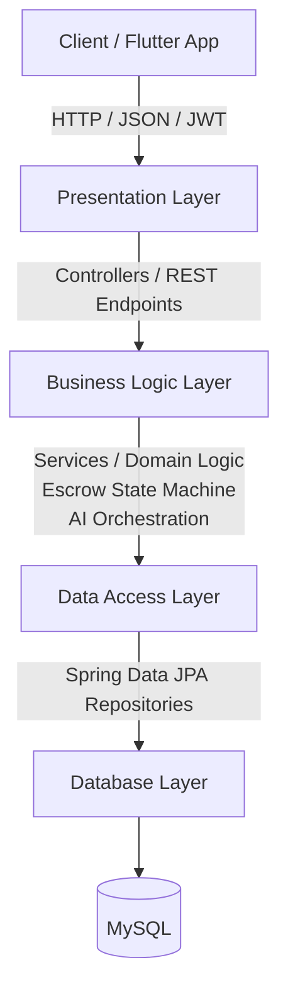

## MatchGuard Backend: Package Structure & Architecture Overview

This document provides a comprehensive guide to the architectural pattern and package layout of the MatchGuard Spring Boot backend. It is designed to help teammates navigate the codebase, understand component responsibilities, and maintain clean separation of concerns.

---

### Architecture Overview

MatchGuard follows a Standard Layered Architecture (N-Tier Architecture) combined with service-oriented abstractions for external AI APIs and utilities. This ensures high maintainability, testability, and modularity.

### Architecture Flow



---

### Key Architectural Layers:

1. Presentation Layer (`controller`): Handles incoming HTTP requests, validates input payloads, enforces security annotations, and returns formatted JSON responses.


2. Business & Integration Layer (`service`): Contains core business logic, coordinates database transactions, and integrates with external systems (LLM AI for scam detection/OCR, ZXing for QR generation).


3. Data Access Layer (`repository`): Manages database operations using Spring Data JPA interfaces without requiring boilerplate SQL implementation.


4. Security & Configuration (`security, config`): Enforces stateless authentication via JWT filters and configures application-wide beans.


---

### Standard Package Structure

The source code is organized under the root package c`om.matchguard.` Below is the directory tree and description of each package.

```text
src/main/java/com/matchguard/
│
├── MatchGuardApplication.java        # Main Spring Boot entry point
│
├── config/                           # Global configuration classes
│   ├── SecurityConfig.java
│   └── AppConfig.java
│
├── controller/                       # Presentation Layer (REST Endpoints)
│   ├── AuthController.java
│   ├── ProductController.java
│   └── TransactionController.java
│
├── service/                          # Business Logic & Integration Layer
│   ├── AuthService.java
│   ├── ProductService.java
│   ├── TransactionService.java
│   ├── AiScamDetectionService.java
│   ├── AiSearchService.java
│   ├── AiOcrService.java
│   └── QrCodeService.java
│
├── repository/                       # Data Access Layer (Spring Data JPA)
│   ├── UserRepository.java
│   ├── ProductRepository.java
│   └── TransactionRepository.java
│
├── model/                            # Domain Entities & Enums
│   ├── User.java
│   ├── Product.java
│   ├── Transaction.java
│   └── enums/
│       ├── Role.java
│       └── TransactionStatus.java
│
├── dto/                              # Data Transfer Objects (Request/Response Payloads)
│   ├── auth/
│   ├── product/
│   └── transaction/
│
├── security/                         # JWT Authentication & Authorization
│   ├── JwtTokenProvider.java
│   ├── JwtAuthenticationFilter.java
│   └── CustomUserDetailsService.java
│
└── exception/                        # Global Exception Handling
    ├── GlobalExceptionHandler.java
    └── ResourceNotFoundException.java

```

---

